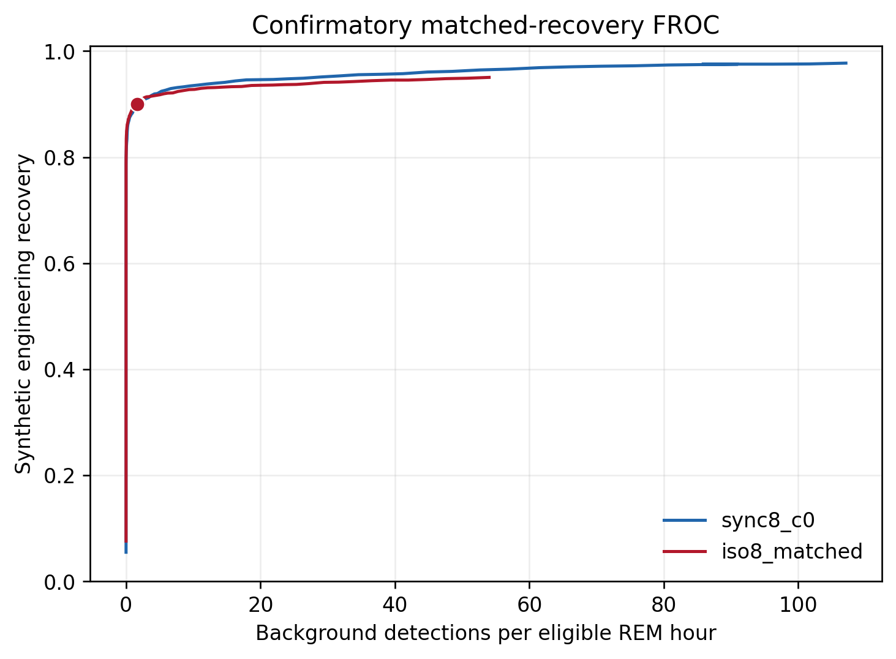

# Confirmatory matched-recovery FROC results

## Integrity and cohort

The primary Sleep-EDF sleep-cassette analysis used all 129 prespecified nights
from the 66 participants not used in the pilot. Before signal access, the
runner verified all 258 source files against the frozen SHA256 manifest and
verified the committed code, configuration and manifests.

The final cohort contributed 177.133 eligible expert-scored REM hours and
2,563 paired synthetic injections per code. It exceeded every prespecified
precision target: 60 participants, 150 eligible REM hours and 1,200 primary
injections.

The study required three documented amendments. The official PhysioNet S3
mirror was added as an optional transport, a Windows line-ending error in the
preflight seal was corrected before any EDF was opened, and the candidate
storage floor was lowered from 0.45 to 0.0 after the first inferential attempt
stopped because some bootstrap thresholds fell below the retained score range.
No comparative estimate or interval was produced before the score-support
amendment. Full details are in [the amendment log](amendments.md).

## Primary result

At the prespecified 90% matched engineering-recovery point, the synchronized
code did not have a lower background collision rate than the matched
isochronous control.

| Quantity | `sync8_c0` | `iso8_matched` |
|---|---:|---:|
| Matched threshold | 0.662990 | 0.639116 |
| Synthetic recovery | 2307/2563, 90.012% | 2307/2563, 90.012% |
| Background events | 323 | 300 |
| Events per eligible REM hour | 1.823 | 1.694 |

The primary rate difference, synchronized minus isochronous, was 0.130 events
per REM hour. Its participant-clustered 95% bootstrap interval was -1.149 to
1.102, based on 50,000 replicates that reselected both matched thresholds. The
rate ratio was 1.077.

The upper interval was not below zero and the rate ratio was not at most 0.70.
The statistical superiority criterion and the practical advancement gate both
failed. Because the point estimate is positive, the proposed 90% recovery
advantage is not supported. The wide interval is not evidence that the codes
are equivalent.

## Prespecified secondary operating points

The primary gate failed, so the 85% and 95% operating points are descriptive
and cannot replace the primary result.

| Recovery target | Synchronized rate/h | Isochronous rate/h | Difference/h | Clustered 95% interval | Rate ratio |
|---:|---:|---:|---:|---:|---:|
| 85% | 0.192 | 0.090 | 0.102 | -0.005 to 0.186 | 2.125 |
| 90% | 1.823 | 1.694 | 0.130 | -1.149 to 1.102 | 1.077 |
| 95% | 27.155 | 52.571 | -25.416 | -48.248 to -4.373 | 0.517 |

The direction reverses between moderate and very high recovery. At 95%
recovery, the synchronized code has substantially fewer background collisions,
but this operating point is inferentially gated by the failed primary test.
It is a new hypothesis about a crossing FROC tradeoff, not a confirmed effect.

## Reproducibility checks

The complete analysis was rerun independently from the saved result tables.
All eight output files, including the PDF, PNG, thresholds, contrasts and
50,000-replicate summary, were byte-for-byte identical.

The amended scan retained 93,370 score-floor background candidates. All 28,535
events at or above the original 0.45 floor were identical to the first scan.
Exposure, injection locations, amplitudes and perturbation seeds were also
identical. The zero floor recovered actual low matched scores for 93 of 5,126
synthetic code rows that the first scan had encoded as zero-score nonmatches.

Machine-readable combined inputs are under
`outputs/ocular-code-confirmatory/sc/`. Final thresholds, FROC tables, figure
and inference are under `outputs/ocular-code-confirmatory/sc-analysis/`.

## Scientific decision

The synchronized code should not advance as a generally superior activation
marker at the prespecified 90% operating point, and this study does not justify
a human lucid-dream production experiment with it.

The untouched sleep-telemetry and CAP corpora will not be interpreted as
secondary confirmation under this failed primary gate. They can support a new,
separately frozen study of the hypothesis suggested by the 95% FROC crossing.
That study must be committed before either corpus is downloaded or opened.

These results concern accidental physiological pattern collisions and
synthetic engineering recovery. They estimate neither human sensitivity nor
dream communication accuracy, and they provide no evidence for telepathy or
anomalous information transfer.
