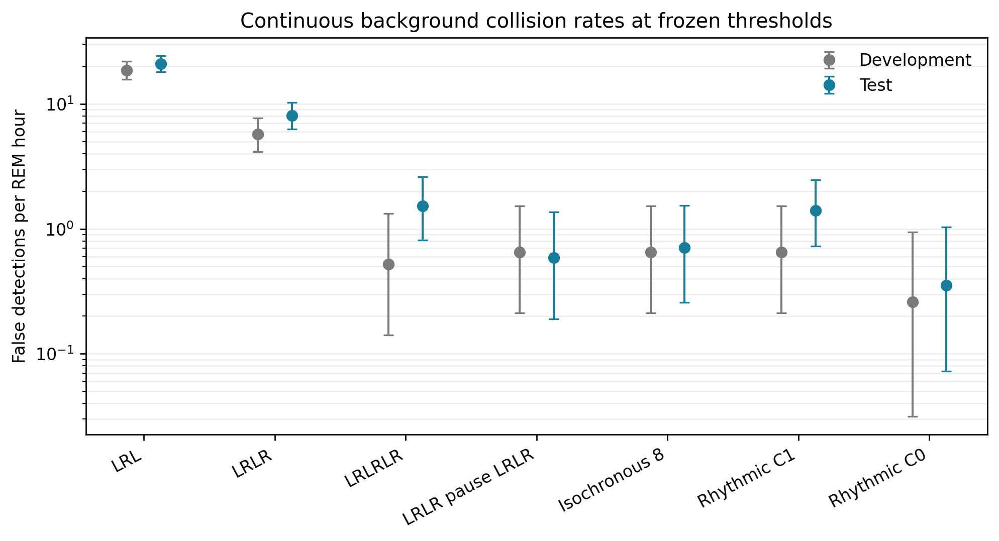
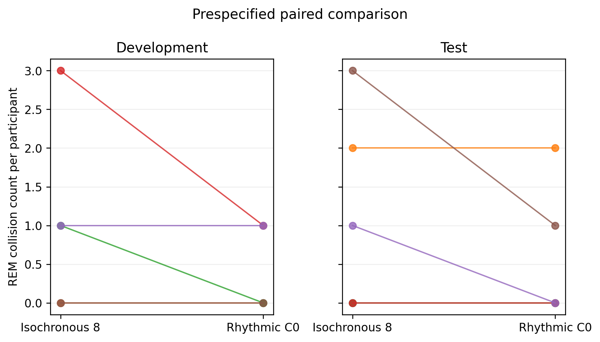
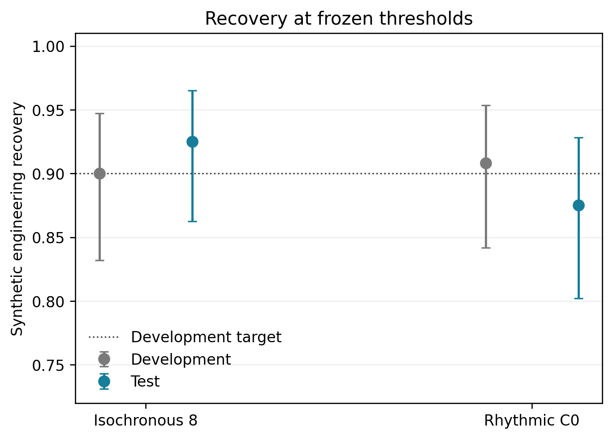

# Ocular-code pilot: sealed test results

## Integrity of the test

The six reserved participants were evaluated once from clean commit
`770ee79394e616f2ab3ddf7aaa4150d2b17ac0e9`. Before loading any waveform, the
runner verified:

- all 12 test files against the SHA-256 values in the frozen manifest;
- the committed development-threshold file;
- exact hashes of the benchmark, codebook and manifest;
- exact hashes of the runner and four source modules;
- a clean Git worktree.

The test contains 8.516 hours of eligible expert-scored REM and 137.25 hours
of full-recording exposure from subjects 06 through 11. The source files are
not tracked. The complete machine-readable test outputs are tracked under
`outputs/ocular-code-pilot/test/`.

## Results at frozen development thresholds

Synthetic recovery is an engineering check on perturbed injected waveforms.
It is not human sensitivity.

| Code | Frozen threshold | Test synthetic recovery | REM events | REM rate/h (95% CI) | Full events | Full rate/h (95% CI) |
|---|---:|---:|---:|---:|---:|---:|
| `double_lrlr_pause` | 0.675 | 107/120 | 5 | 0.587 (0.191, 1.370) | 110 | 0.801 (0.659, 0.966) |
| `iso8_matched` | 0.675 | 111/120 | 6 | 0.705 (0.259, 1.534) | 142 | 1.035 (0.871, 1.219) |
| `legacy_lrl` | 0.800 | 100/120 | 179 | 21.020 (18.054, 24.335) | 3,922 | 28.576 (27.688, 29.484) |
| `legacy_lrlr` | 0.775 | 107/120 | 69 | 8.103 (6.304, 10.255) | 1,295 | 9.435 (8.928, 9.964) |
| `legacy_lrlrlr` | 0.725 | 108/120 | 13 | 1.527 (0.813, 2.611) | 297 | 2.164 (1.925, 2.425) |
| `sync8_c0` | 0.725 | 105/120 | 3 | 0.352 (0.073, 1.030) | 38 | 0.277 (0.196, 0.380) |
| `sync8_c1` | 0.675 | 105/120 | 12 | 1.409 (0.728, 2.462) | 143 | 1.042 (0.878, 1.227) |

The REM confidence intervals are exact Poisson intervals. The full-recording
analysis is deliberately ungated and includes long periods outside REM. It is
not the performance of an automatic sleep-stage gate.

## Primary contrast

The prespecified `sync8_c0` candidate produced three REM collisions, compared
with six for the equal-duration isochronous control. Their rates were 0.352
and 0.705 events per REM hour. The aggregate rate difference was -0.352 events
per REM hour, with a 10,000-replicate participant-clustered bootstrap interval
from -0.832 to 0.000.

The paired direction also replicated at the participant level:

- the codes tied in subjects 06, 07, 08 and 09;
- `sync8_c0` had one fewer event in subject 10;
- `sync8_c0` had two fewer events in subject 11;
- `sync8_c0` was not worse in any test participant.

The confidence interval includes zero and there were only two discordant
participants. This pilot therefore supports scaling, but it is not a decisive
population-level test.

In the secondary full-recording analysis, `sync8_c0` produced 38 events versus
142 for the matched control, corresponding to 0.277 versus 1.035 events per
hour. The direction and approximate magnitude agree with development, where
the counts were 31 versus 115.

## Important qualification

The codes were matched on synthetic recovery in development. At the frozen
thresholds, test recovery was 87.5% for `sync8_c0` and 92.5% for the matched
control. That five-point transport difference could explain some of the lower
collision count. A full benchmark must therefore report complete FROC curves
and compare codes at several prespecified recovery levels, not rely on one
operating point.

The second rhythmic word did not inherit the advantage. `sync8_c1` produced
12 REM collisions and was especially poor in subjects 06, 07 and 11. The
current pair should not be described as a working binary alphabet. The result
supports `sync8_c0` as a candidate activation marker only.

## Descriptive pooled pilot

Pooling development and test for description, not confirmatory inference:

- `sync8_c0`: 5 events in 16.201 REM hours, 0.309/h (95% CI 0.100 to 0.720);
- `iso8_matched`: 11 events, 0.679/h (95% CI 0.339 to 1.215);
- `sync8_c1`: 17 events, 1.049/h (95% CI 0.611 to 1.680).

Across 273.65 full-recording hours, the corresponding rates were 0.252/h,
0.939/h and 1.052/h.

## Scientific decision

The pilot passes the scale-up gate with qualifications:

1. preserve `sync8_c0` and `iso8_matched` as the primary matched comparison;
2. retain LRL and LRLR as historical controls;
3. demote `sync8_c1` from proposed symbol to negative design example;
4. evaluate collision versus synthetic recovery as a full FROC surface;
5. reserve the remaining Sleep-EDF participants and a separate public PSG
   corpus for confirmatory transport;
6. continue to call the outcome background resistance, not communication
   capacity or human sensitivity;
7. test whether people can reliably produce `sync8_c0` while awake before any
   lucid-REM experiment.

The result is relevant to ordinary physiological communication from dreams.
It provides no evidence of telepathy or information transfer without a
physical channel.
